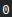
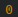
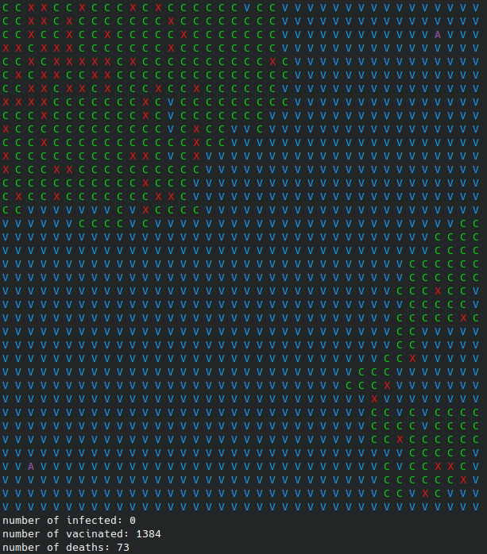
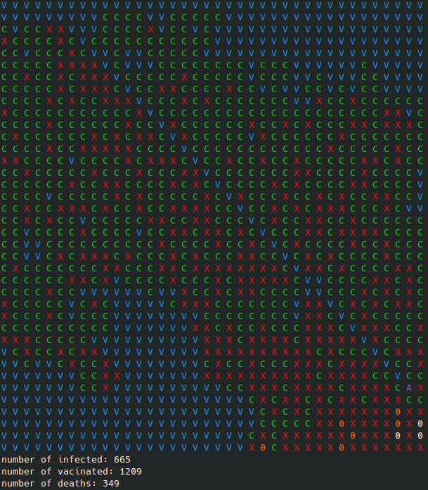

# QuarantineInfectedII

**Número da Lista**: 24  
**Conteúdo da Disciplina**: Grafos 1 

## Alunos
|Matrícula | Aluno |
| -- | -- |
| 18/0117548  |  [Bruno Carmo Nunes](https://github.com/brunocmo) |
| 17/0150747  |  [Marcos Vinícius Rodrigues da Conceição](https://github.com/marcos-mv) |

## Video 

https://www.youtube.com/watch?v=iYhs143VU04

## Sobre
Uma melhoria do antigo projeto [QuarantineInfected](https://github.com/projeto-de-algoritmos/Grafos1_QuarantineInfected), sendo que é incluido mais estados de vitalidade e também a adição de busca em profundidade (DFS). 

 => Pessoa com saúde

 => Pessoa infectada

 => Pessoa falecida

 => Agente de saúde

 => Pessoa vacinada

 => Pessoa curada

------------------------------------------------

***Sobre retirado do antigo programa***

Devido a crise atual do COVID-19 foi feito uma simulação que mostra a progressão de infectados de um espaço confinado no CLI(40x40). Sendo que os agentes de saúde tem o trabalho de identificar e colocar em quarentena os infectados. Ambos os casos é utilizado o método de busca em largura (BFS) para a identificação e infecção de nós.

------------------------------------------------

Adição de GUI, e outras funcionalidades

## Instalação
**Linguagem**: C++ 

Feito e usado no kernel: **Linux 6.0.8-arch1-1 x86_64**

Tenha o *git*, *make*, *cmake* e o compilador *c++* instalado na sua maquina.

Para clonar:

`git clone https://github.com/projeto-de-algoritmos/Grafos1_QuarantineInfectedII.git`

Para compilar o programa:

`cd Grafos1_QuarantineInfectedII/`

`mkdir build && cd build/`

`cmake ..`

`make`

Para executar o programa:

`./QuarantineInfectedII`

Para parar o programa:

`CTRL+C`

## Uso

Após rodar o programa, execute as opções:

1. BFS - 1 contaminado e 1 agente de saúde
2. BFS - 1 contaminado e 2 agentes de saúde 
3. DFS - 1 contaminado e 1 agentes de saúde
0. Sair

Espere e veja como a matrix se comporta com os infectados e agentes de saúde trabalham.

Para sair aperte ***CTRL-C***

## Outros

Quando executar o programa no CLI, use-o em tela cheia para melhor aproveitamento do mesmo.

## Screenshots

Figura 1 - BFS com 2 agentes de saúde.

Figura 2 - DFS com 1 agentes de saúde.

